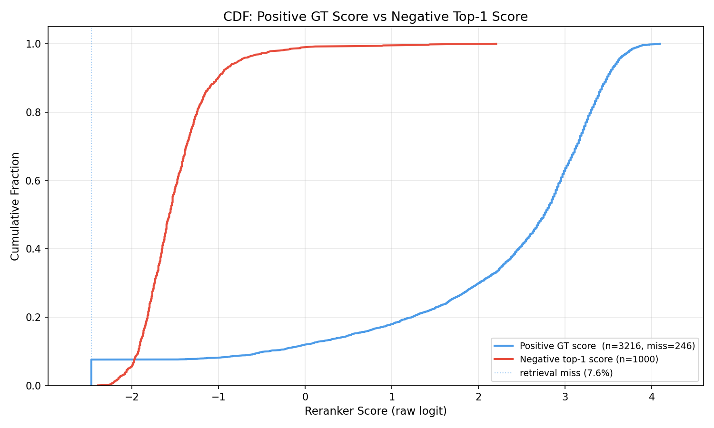
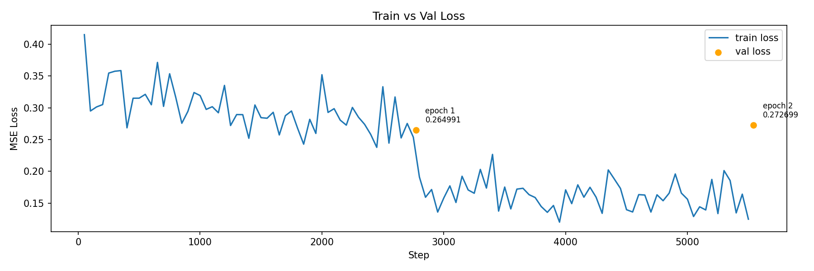

# RAG Pipeline Development Log

## 1. Walking Skeleton

Minimal end-to-end pipeline to validate system connectivity:
- **Parse**: `RecursiveCharacterTextSplitter`, text only (images ignored)
- **Retrieve**: BM25 only
- **Generate**: Llama-3.1-8B-Instruct (no fine-tuning)

---

## 2. Parse Optimization

### Analysis Method

After each change, run `experiments/parse_analysis.py` to dump all chunks to `experiments/chunk_dump_<date>.txt` and inspect visually.

---

### Issues & Fixes (in order)

| # | Issue | Fix | Status |
|---|-------|-----|--------|
| 1 | Cover/back matter included (TOC, index, etc.) | Filter by `PAGE_START` / `PAGE_END` in `load_pdf()` | ✅ |
| 2 | Header/footer text leaking into chunks | Crop page rect by `PAGE_CROP_TOP` / `PAGE_CROP_BOTTOM` via fitz | ✅ |
| 3 | Dirty formatting (`\n` artifacts from two-column PDF layout) | TRY 1: regex (newline preceded by `.!?` + followed by uppercase) — partially effective. TRY 2: LLM-based cleaning (`llm_clean.py`, `temperature=0`) ✅ | ✅ |
| 4 | Chunks mixing content from different sections | LLM-based split — see notes below | ✅ |
| 5 | Cross-page splits | Deferred — see notes below | 🔲 |

---

### Chunk Word Count Distribution


---

### Issue 4: Chunks Mixing Content from Different Sections

**Problem:**
`RecursiveCharacterTextSplitter` splits purely by token count with no awareness of document structure. Results in chunks that mix unrelated content (e.g. a safety warning merged with an unrelated operation step, or two separate alert entries in one chunk).

**TRY 1 — Semantic chunking** (`bge-m3` embeddings + cosine similarity breakpoints)
- Split pages by `\n\n` into paragraphs, compute embedding similarity between adjacent pairs, split at low-similarity boundaries
- Problem: adjacent entries share similar embeddings regardless of being different topics (e.g. two charging error alerts have near-identical surface form). Similarity score alone cannot detect structural boundaries.
- Result: ❌

**TRY 2 — LLM-based split**
- `LLM_CLEAN_PROMPT` asks the LLM to clean the text AND insert `<<<SPLIT>>>` before each new semantic unit in a single pass. `chunk_index.py` then splits on `<<<SPLIT>>>` — no embedding logic needed.
- Why LLM over rules/regex: the manual contains many section types (alert entries, feature descriptions, numbered instructions, spec tables, warnings) with inconsistent structural signals. Rules cannot generalize; LLM reads structure like a human.
- Result: ✅

**Prompt design decisions:**
- Semantic unit defined as: topic/subject/focus clearly shifts, signaled by a new code-like identifier (e.g. `PCS_a073`) OR a new heading/title
- Delimiter `<<<SPLIT>>>` chosen over `---SPLIT---`: LLM confused `---` with markdown horizontal rule and abbreviated it
- Added rule "do not split numbered or bulleted lists": LLM was treating each list item as a separate unit
- `temperature=0` for deterministic output across runs

**Pipeline after fix:**
```
load_pdf() → llm_clean_and_split() → pickle → split on <<<SPLIT>>> → save() → MongoDB
```

---

### Metadata Addition: `chunk_index`

Added `chunk_index` (global, zero-based, continuous across pages) to each chunk's metadata at index time.

**Reason:** Required for reranker fine-tuning — when mining hard negatives, chunks adjacent to the ground truth (`chunk_index` distance ≤ 1) must be excluded regardless of page boundary. Page number alone is unreliable: two chunks on different pages may be content-continuous (cross-page split, Issue 5), and two chunks on the same page may be semantically unrelated. `chunk_index` is the only reliable proximity signal.

**Impact:** `chunk_index.py` rerun required after any re-chunking. QA dataset unaffected — `unique_id` is `md5(page_content)` and does not depend on metadata.

---

### Issue 5: Cross-Page Splits

**Problem:**
`load_pdf()` processes one page at a time. An alert entry that starts on page N and ends on page N+1 becomes two separate `Document` objects before any LLM or chunking step runs. No prompt or chunking strategy can fix a problem that originates at the parsing stage.

Observed example: `PCS_a073` header on page 287, full body on page 288 — two separate chunks.

**Investigated approaches:**

| Approach | Verdict |
|----------|---------|
| Hard rules (detect incomplete page by missing `What to do:` section) | ❌ Unreliable — page can end after alert title with no detectable signal |
| LLM merge (detect and merge incomplete pages before cleaning) | ✅ Correct but adds pipeline complexity and an extra LLM call per page |
| Overlapping page pairs `[N, N+1]`, `[N+1, N+2]` | ❌ Shifts the problem rather than solving it; also doubles collection size |
| Increase `TOPK` | ✅ Pragmatic mitigation — retrieval will likely surface both halves for a relevant query |

**Decision: defer.**
With `TOPK=10`, retrieval likely surfaces both halves of a split alert together in context. Downstream impact is further mitigated by BM25 union (which recovers short incomplete chunks via exact keyword match — see Section 3) and the reranker (which scores both halves above threshold at `RERANKER_THRESHOLD=0.1` — see Section 4). Revisit only if answer quality is measurably degraded.

**If fix becomes necessary:** implement LLM merge as a `merge_pages()` step in `parse.py`, storing page range `[N, N+1]` in metadata instead of a single page number to preserve source traceability.

---

### Refactor

`parse.py` split into two scripts for independent re-runs:
- `parse.py`: `load_pdf()` → `llm_clean_and_split()` → pickle
- `chunk_index.py`: load pickle → split on `<<<SPLIT>>>` → `save()` → MongoDB

---

## 3. Retrieval Optimization

### Overview

BM25-only retrieval is purely keyword-based — semantically equivalent queries with different wording can miss relevant chunks. Upgraded to a three-signal hybrid pipeline combining dense, sparse, and lexical retrieval.

---

### Architecture

```
query
  ├── BGE-M3 dense  ──┐
  ├── BGE-M3 sparse ──┤ RRF fusion (Milvus internal) → top-k
  │                   └─────────────────────────────────────────┐
  │                                                             │ union + dedup
  └── BM25 ──────────────────────────────────────── top-k ──────┘
                                                      ↓
                                               candidate pool (~14-20 docs)
                                                      ↓
                                                   reranker
                                                      ↓
                                                 LLM generate
```

---

### Retriever: BGE-M3 (`retrieve_bge.py`)

**Why bge-m3:**
`bge-m3` is a unified model producing dense, sparse, and ColBERT vectors in a single forward pass. Using it for both dense and sparse retrieval eliminates the need for a separate sparse embedder and keeps the embedding space consistent.

**Dense vs sparse vector types and distance metrics:**
- Dense vectors encode full-sentence semantics into a fixed-size vector. Retrieved by `COSINE` similarity (bge-m3 dense vectors are not L2-normalized, so cosine is the correct metric).
- Sparse vectors encode token-level importance as learned weights (analogous to BM25 TF-IDF but learned). Retrieved by `IP` (inner product). Cosine is not meaningful for sparse non-negative weights. **IP is the only correct metric here — not tunable.**

**ColBERT excluded:**
ColBERT stores one vector per token (N vectors/doc vs 1 for dense) — ~50× storage increase. Milvus-lite has limited ColBERT support. Diminishing returns expected for a single-domain manual corpus where a cross-encoder reranker already handles fine-grained relevance. Revisit if quality remains poor after reranker.

**`encode_queries` vs `encode`:**
bge-m3 prepends an internal query-specific prefix during `encode_queries()`. This prefix shifts the embedding distribution toward the query space, which is critical for asymmetric retrieval (short query vs long document). Using `encode()` for queries degrades retrieval quality. Always: `encode_queries()` for queries, `encode()` for documents.

**Index persistence:**
Collection build skipped if Milvus collection already exists (`force_rebuild=False`). Always pass `force_rebuild=True` explicitly after re-chunking to keep the index in sync with MongoDB.

---

### Fusion: RRF (Reciprocal Rank Fusion)

**Principle:** RRF combines multiple ranked lists by assigning each document a score of `1 / (k + rank)`, where `k=60` is a smoothing constant, then summing scores across lists. Documents ranked highly in multiple lists accumulate higher combined scores.

**Why RRF over WeightedRanker:**
RRF is rank-based — it requires no score normalization across heterogeneous scales (BM25 scores vs cosine similarity vs IP are not directly comparable). `WeightedRanker` requires careful per-signal scale calibration. RRF is the correct default when signals have incompatible score distributions.

**`k=60`:** Standard constant from the original RRF paper (Cormack et al., 2009). Controls the penalty for lower-ranked documents. Results are empirically not sensitive to this value; not worth tuning.

**Dense:sparse ratio:** Implicitly 1:1 with RRF (equal weight by default). To tune the ratio explicitly, switch to `WeightedRanker(sparse_weight, dense_weight)` — defer until eval data justifies it.

---

### Hybrid: BM25 Union (`retrieve_hybrid.py`)

**Why BM25 as a union instead of a third RRF signal:**
BGE sparse already covers most of BM25's lexical matching capability (learned sparse weights vs frequency-based TF-IDF). Adding BM25 as a third RRF signal would rarely change rankings. Instead, BM25 is added as a **safety net**: any document retrieved by BM25 is guaranteed to appear in the candidate pool regardless of RRF rank, ensuring exact keyword matches are never silently dropped.

**Validated case:**
Query "How to Adjust the Shoulder Anchor Height" — page 46 (step 4 continuation, a short cross-page split chunk) was missed by BGE hybrid search. Its dense embedding is less representative due to short length, and it gets pushed down by longer, semantically richer chunks. BM25 union recovers it via exact keyword match ("shoulder", "anchor", "button").

**Dedup order:** BGE results first, BM25-only results appended at end. BGE-ranked order is preserved for the reranker.

---

## 4. Reranker (Off-the-Shelf)

### Overview

Hybrid retrieval returns ~14-20 candidates, many of which share surface-level keyword overlap with the query but are semantically irrelevant (e.g. "Adjusting Liftgate Opening Height" retrieved for "How to Adjust the Shoulder Anchor Height"). A cross-encoder reranker scores each (query, chunk) pair jointly to filter and re-sort these candidates before generation.

---

### Architecture

```
~14-20 candidates from HybridRetriever
  ↓
cross-encoder: score each (query, chunk) pair jointly
  ↓
threshold filter (score > RERANKER_THRESHOLD)
  ↓
sort by score descending
  ↓
top-k chunks → LLM
```

---

### Bi-encoder vs Cross-encoder

**Bi-encoder** (used in retrieval): query and document are encoded independently into vectors; similarity computed by dot product or cosine. Fast for large-scale retrieval but captures query-document interaction only implicitly through embedding space proximity.

**Cross-encoder** (used in reranking): query and document are concatenated and processed jointly through a full transformer forward pass. The model attends to both texts simultaneously, capturing fine-grained query-document interactions. Much more accurate for relevance scoring but too slow (~O(n) forward passes) for full-corpus retrieval — only feasible on a small candidate set.

**Why cross-encoder over threshold on hybrid search scores:**
RRF scores are rank-derived (`1/(60+rank)`) — they reflect list position, not semantic relevance, and cannot be directly thresholded. Cross-encoder scores are calibrated relevance signals (with `normalize=True`, mapped to `[0, 1]`) and are directly interpretable as a relevance threshold.

---

### Model: `bge-reranker-v2-m3`

- Cross-encoder from the same BAAI family as bge-m3
- Input: concatenated `(query, passage)` pair → single scalar relevance score
- `normalize=True`: sigmoid-maps raw logits to `[0, 1]` for interpretable thresholding
- Score stored in `doc.metadata["rerank_score"]` for downstream debugging and threshold calibration

---

### Threshold Calibration

`RERANKER_THRESHOLD=0.1` — validated on query "How to Adjust the Shoulder Anchor Height":
- Page 45 (main procedure): `0.9994` ✅
- Page 46 (step 4 continuation, cross-page split): `0.23` ✅
- All 12 irrelevant candidates: dropped ✅

**Constraint from Issue 5:**
Page 46 is a short incomplete chunk (step 4 only, lacks full context). Its rerank score (`0.23`) is substantially lower than page 45 (`0.9994`) despite being part of the same procedure. This is expected — the chunk lacks full context. It survives `RERANKER_THRESHOLD=0.1` but is fragile. **Do not raise threshold above `0.2` until Issue 5 (cross-page merge) is resolved.**

---

### Decisions Deferred

| Decision | Reason |
|----------|--------|
| Qwen3-Reranker-4B | Heavier (4B params), slower; current cross-encoder sufficient for observed query patterns. Revisit for complex multi-faceted queries |
| Query decomposition | Multi-part queries ("how to adjust X and Y") degrade retrieval + reranking. Implement if such patterns appear in eval |
| WeightedRanker sparse:dense ratio | No eval data yet to justify tuning |
| RERANKER_THRESHOLD fine-tuning | Blocked by Issue 5 — page 46 is fragile at current threshold |

---

## 5. Evaluation Dataset Generation

### Overview

Before optimizing any pipeline component, a ground truth QA dataset is needed to separate retrieval failures from generation failures. Without it, there is no signal on which layer is the bottleneck.

---

### Architecture

```
MongoDB chunks
      ↓
length filter (>= 15 words)        ← skip short/context-dependent chunks
      ↓
LLM generate 5 QA pairs per chunk
      ↓
LLM quality filter (score 1–5)     ← score each pair, save all with scores
      ↓
question expansion (3 paraphrases per question)
      ↓
train/val/test split (70/20/10)    ← split at item level before flattening
      ↓
add MS MARCO negative samples
      ↓
final dataset: {question, answer, source_chunk_id}
```

---

### Ground Truth Mapping

QA generated **per chunk**. `source_chunk_id` is known before the LLM call.

- `source_chunk_id` → retrieval eval: did the retriever surface the right chunk?
- `question` + `answer` → generation eval: is the answer faithful and relevant?

---

### Pipeline: `generate.py`

- Load all chunks from MongoDB, filter by `MINIMAL_CHUNK_SIZE = 15` words
- Concurrent LLM calls via `ThreadPoolExecutor(MAX_WORKERS=20)`
- Checkpoint by `source_chunk_id` — safe to resume after interruption
- Output: `data/qa_pairs/qa_raw.jsonl` — `{source_chunk_id, page, raw_resp}`

---

### Pipeline: `filter.py`

- LLM scores each (question, answer, chunk) triple on a 1–5 scale
- Checkpoint by `(source_chunk_id, question)` — safe to resume
- Nothing dropped at this stage: all pairs saved with scores for flexible downstream filtering
- Output: `data/qa_pairs/qa_filtered.jsonl`

**Score criteria:**
| Score | Meaning |
|-------|---------|
| 5 | Perfectly grounded, complete, self-contained |
| 4 | Mostly grounded, minor incompleteness |
| 3 | Acceptable but partially incomplete |
| 2 | Missing key info or partially ungrounded |
| 1 | Hallucinated, or references page numbers/sections |

---

### Pipeline: `expand.py`

- Load `qa_filtered.jsonl`, keep only `score >= MIN_SCORE`
- For each QA pair: LLM generates 3 paraphrases of the original question
- Output: `data/qa_pairs/qa_expand.jsonl` — `{source_chunk_id, page, question, answer, paraphrases}`

**Why paraphrases:** A single phrasing does not reflect the diversity of how real users ask the same thing. 3 paraphrases per question triples the effective training set size and improves robustness to query variation.

---

### Fix: Paraphrase Leakage in Train/Val/Test Split

**Problem:**
Original `build_dataset.py` flattened all paraphrases into individual samples first, then split randomly. Paraphrases of the same original question ended up in different splits. Since paraphrases are semantically near-identical, the model had effectively seen the val/test questions during training — inflating eval scores.

**Fix:**
Split at the **item level** (one item = one original question + its paraphrases) before flattening. Each item is assigned to exactly one split. MS MARCO negatives have no paraphrases and are split randomly as before.

---

### Length Filter Edge Case

`MINIMAL_CHUNK_SIZE = 15` words filters out most context-dependent short chunks. However, the page 46 cross-page split chunk (~130 chars, step 4 only) passes the length filter but is context-dependent. It will likely produce low-quality QA pairs caught by the quality filter (score 1–2). This is acceptable — the filter is designed to handle exactly this.

---

## 6. Retrieval Evaluation

### Overview

Systematic comparison of retriever configurations on the test set (500 samples) to identify the best-performing pipeline before optimizing generation.

---

### Metrics

**Hit@k:** Binary signal — 1 if the ground truth `source_chunk_id` appears in top-k results, else 0. Averaged over all questions. Measures whether the correct chunk is retrievable at all within the top-k budget.

**MRR (Mean Reciprocal Rank):** `1/rank` if ground truth is found within top-k, else 0. Averaged over all questions. Measures ranking quality — rewards surfacing the correct chunk at rank 1 more than rank 5. Computed at a fixed k (k=20 here) across all retrievers.

**Why not Recall@k or Precision@k:**
Each question has exactly one ground truth `source_chunk_id`. Under single-label ground truth, Recall@k = Hit@k (identical). Precision@k penalizes retrievers for returning unchosen-but-relevant chunks — this is unreliable when ground truth is a single label.

**k sweep:** `EVAL_K_VALUES = [1, 5, 10, 15, 20]`. For each retriever: retrieve top-20 once, slice to each k — avoids redundant retrieval calls per question.

---

### Results (off-the-shelf, 500 test samples)

| Retriever | Hit@1 | Hit@5 | Hit@10 | Hit@15 | Hit@20 | MRR |
|-----------|-------|-------|--------|--------|--------|-----|
| BM25 | 0.4373 | 0.7407 | 0.8139 | 0.8480 | 0.8610 | 0.5687 |
| BGE | 0.5130 | 0.8213 | 0.8834 | 0.9212 | 0.9386 | 0.6467 |
| Hybrid+Reranker | 0.6346 | 0.9057 | 0.9485 | 0.9578 | 0.9634 | 0.7522 |

`Hybrid+Reranker` evaluated with `RERANKER_THRESHOLD=0.0` (threshold filtering disabled) to measure pure ranking quality independent of threshold choice.

---

### Findings

**BGE vs BM25:** BGE improves Hit@10 by +0.070 (0.8139 → 0.8834) and MRR by +0.078 (0.5687 → 0.6467). Semantic retrieval meaningfully outperforms keyword matching across all k values.

**Reranker improves ranking precision significantly:** Hybrid+Reranker Hit@1 jumps +0.121 over BGE alone (0.5130 → 0.6346), MRR +0.106 (0.6467 → 0.7522). The cross-encoder effectively surfaces correct chunks that hybrid retrieval places at rank 11–20 into the top-5.

**Remaining gap:** ~1.5% of queries miss at Hit@10 and ~3.7% miss at Hit@20. The primary failure modes are cross-page split chunks (Issue 5) and queries where the correct chunk is absent from the candidate pool entirely. → See Section 7 for reranker fine-tuning results.

[TODO: 补充 2-3 个具体的 retrieval miss bad case，说明根因。Issue 5 cross-page split 算一个，还有哪些其他模式？]

---

## 7. Reranker Fine-tuning

### Motivation

Off-the-shelf reranker evaluation shows that most misses at Hit@10 are **ranking failures** — the correct chunk is present in the top-20 candidate pool but ranked below position 10. The reranker has not seen domain-specific Tesla Model Y terminology and alert code patterns during pre-training. Fine-tuning on in-domain (query, chunk) pairs with graded relevance labels is expected to improve Hit@1 and MRR by pushing the correct chunk closer to rank 1.

---

### Training Data: Hard Negative Mining (`mine.py`)

**Why hard negatives matter:**
Random negatives (arbitrary chunks unrelated to the query) are too easy — the model learns to distinguish clearly irrelevant content but fails on confusable cases. Hard negatives are chunks the retriever ranks highly but are not the ground truth — they share surface-level overlap with the query and force the model to learn finer-grained relevance distinctions.

**Mining pipeline:**
```
train.jsonl / val.jsonl  (positives only, source_chunk_id != None)
    ↓
HybridRetriever (topk=20) → off-the-shelf Reranker (threshold=0.0) → ranked list
    ↓
adjacency filter: exclude abs(candidate.chunk_index - gt.chunk_index) <= 1
    ↓
weak_pos pool = filtered ranks 2–5   → sample 1
neg pool      = filtered ranks 6–10  → sample 1
    ↓
emit 3 samples per query:
  (query, gt_chunk,       1.0)   ← ground truth positive
  (query, weak_pos_chunk, 0.5)   ← retrieved but not ground truth
  (query, neg_chunk,      0.0)   ← retrieved, clearly not ground truth
```

**Note on bootstrap:** The first mining pass uses the off-the-shelf reranker (not a fine-tuned one) to produce the ranked list. This introduces mild exposure bias — the training data distribution is shaped by the model being replaced. The effect is limited at this corpus scale because ground truth labels always come from the QA dataset, not from the reranker's scores.

**Why rank the candidates before sampling:**
HybridRetriever output is not relevance-ranked (BGE results first, BM25 appended). The rank windows (2–5 for weak positive, 6–10 for negative) are only meaningful after reranker scoring produces a semantically ordered list.

**Adjacency filter uses `chunk_index`, not page number:**
Cross-page splits (Issue 5) mean adjacent chunks may be on different pages. `chunk_index` is the only reliable proximity signal across page boundaries.

**MINE_TOPK=20:**
Fetching 20 candidates (instead of 10) ensures the neg pool (ranks 6–10) remains non-empty after adjacency filtering removes ground truth and its neighbors.

**Dataset size:**
- Train: 11,264 triplets → 33,792 flat samples (×3)
- Val: 3,216 triplets → 9,648 flat samples (×3)

---

### Dataset (`dataset.py`)

Each triplet is flattened into 3 samples in fixed order:
```
(query, pos_chunk,      1.0)
(query, weak_pos_chunk, 0.5)
(query, neg_chunk,      0.0)
```

Tokenization: `AutoTokenizer` with `text_pair` input, `MAX_LENGTH=768`.

**Why MAX_LENGTH=768:**
Chunk token length distribution: max=1053, P99=686, P95=477, avg=183.
768 comfortably covers P99 (686 tokens) plus query (~50 tokens) plus special tokens, with minimal truncation at the tail.

---

### Training Design (`train.py`)

| Decision | Choice | Reason |
|----------|--------|--------|
| Base model | bge-reranker-v2-m3 | Consistent with inference pipeline; no distribution shift at inference |
| PEFT | LoRA (r=16, alpha=32, dropout=0.1) | Full fine-tuning risks overfitting on ~33k samples; LoRA constrains updates to a low-rank subspace |
| Loss | Pointwise MSE | Directly supervises graded relevance (1.0 / 0.5 / 0.0); pairwise BCE is binary and discards the weak-positive tier |
| dtype | bfloat16 | Same exponent range as float32; avoids fp16 overflow on large logit values during training |
| Optimizer | AdamW | Standard for transformer fine-tuning |
| LR | 2e-4 | Standard LoRA starting point |
| Batch size | 16 | RTX 4090 D (24GB) limit; 32 causes OOM |
| Epochs | 3 | Val loss plateaus after epoch 2; epoch 3 shows slight increase |

**LoRA hyperparameters explained:**
- `r` (rank): the rank of the low-rank decomposition matrices. Controls the number of trainable parameters. `r=16` adds two matrices of shape `[d, 16]` and `[16, d]` per target layer. Smaller `r` = more regularization, fewer parameters.
- `alpha`: scaling factor applied to the LoRA update: `ΔW = (alpha/r) * BA`. `alpha=32` with `r=16` gives a scaling factor of 2.0. Convention is to set `alpha = 2*r` as a starting point.
- `dropout`: applied to the LoRA input before the low-rank projection. Regularizes the adapter to prevent overfitting on small domain datasets.

**LoRA target modules:** `["query", "key", "value", "dense"]`
Covers all self-attention projections and FFN dense layers across 24 encoder layers (bge-reranker-v2-m3 is a BERT-style encoder).

**Trainable parameters:**
```
trainable params: 8,161,281 || all params: 574,866,433 || trainable%: 1.4197
```

**Classifier head unfrozen explicitly:**
After `get_peft_model()`, all non-LoRA parameters are frozen — including the classifier head (the linear layer that maps encoder output to a scalar relevance score). The head must be explicitly unfrozen to allow the output projection to adapt to the domain-specific regression target. Without this, the head remains at its pre-trained initialization and cannot align with the new label space.

**Why pointwise MSE over pairwise BCE:**
Pairwise BCE is binary — it only distinguishes positive from negative. Our three-tier label design (1.0 / 0.5 / 0.0) encodes graded relevance: the weak-positive tier (0.5) represents chunks that partially overlap with the query's topic but are not the ground truth. MSE directly supervises this gradient; BCE would either collapse 0.5 into positive or discard it entirely.

---

### Logging

Single file `train_steps_{timestamp}.jsonl`:
- Every 50 steps: `{"epoch": int, "step": int, "train_loss": float}`
- Every epoch end: `{"epoch": int, "step": int, "val_loss": float}`

Val loss logged at the step corresponding to epoch end, enabling aligned plotting of train and val loss on the same step axis.

---

### Results


| Epoch | Val Loss |
|-------|----------|
| 1 | 0.071616 |
| 2 | **0.069650** ← best |
| 3 | 0.070668 |

Best checkpoint: `epoch2_valloss_0.06965`

Train loss converges smoothly from ~0.45 to ~0.07 within the first 500 steps, then stabilizes. Val loss tracks train loss closely at epoch end — no significant overfitting.

---

### Retrieval Eval: Full Comparison (Post Fine-tuning)


| Retriever | Hit@1 | Hit@5 | Hit@10 | Hit@15 | Hit@20 | MRR |
|-----------|-------|-------|--------|--------|--------|-----|
| BM25 | 0.4373 | 0.7407 | 0.8139 | 0.8480 | 0.8610 | 0.5687 |
| BGE | 0.5130 | 0.8213 | 0.8834 | 0.9212 | 0.9386 | 0.6467 |
| Hybrid+Reranker (off-the-shelf) | 0.6346 | 0.9057 | 0.9485 | 0.9578 | 0.9634 | 0.7522 |
| Hybrid+FinetunedReranker | **0.6960** | **0.9280** | **0.9529** | **0.9603** | **0.9628** | **0.7972** |

**Key findings:**
- Hit@1: +0.0614 (+9.7% relative) — fine-tuning primarily improves ranking precision, pushing the correct chunk to rank 1 more often
- MRR: +0.0450 (+5.9% relative) — consistent improvement across rank positions
- Hit@10: +0.0044 (marginal) — baseline was already near ceiling at 0.9485; fine-tuning adds recall only at the margin

Fine-tuning improves **ranking precision** (correct chunk ranked higher within the candidate pool), not **recall** (correct chunk already present). This is the expected outcome for reranker fine-tuning on a corpus where retrieval recall is already high.

---

### Decisions Deferred

| Decision | Reason |
|----------|--------|
| RERANKER_THRESHOLD calibration | Fine-tuned model outputs raw logits (not normalized to [0,1]); threshold requires empirical calibration against generation quality after LLM fine-tuning stabilizes |

---

## 8. Generation Baseline

### Overview

With retrieval validated (Hybrid+FinetunedReranker: Hit@10=0.9529, MRR=0.7972), the next step is to establish a generation baseline using the off-the-shelf Llama-3.1-8B-Instruct served via vLLM. This captures generation quality before any LLM fine-tuning and isolates the contribution of the generation component.

---

### Architecture

```
question
    ↓
HybridRetriever (topk=10)
    ↓
FinetunedReranker (threshold=-1.0) → top-5 chunks
    ↓
Llama-3.1-8B-Instruct (vLLM, bfloat16)
    ↓
answer
```

**GENERATION_THRESHOLD=-1.0:** Permissive — passes all reranked chunks to the LLM. Threshold calibration is deferred until after LLM fine-tuning, as fine-tuning may shift what counts as "sufficient" context.

**GENERATION_TOPK=5:** Top-5 chunks passed as context. Balances context completeness against prompt length (each chunk can be 100–700 tokens; at 5 chunks the prompt remains within the 4096 token budget with headroom).



---

### Inference Pipeline (`eval/generate/generate_vllm.py`)

- Loads test set, splits into positives (`source_chunk_id != None`) and negatives
- For each sample: retrieve → rerank → LLM generate
- Negatives that receive no chunks after threshold → return fixed `NO_ANSWER` string
- Records `retrieval_hit` flag per positive sample to decouple retrieval failures from generation failures
- Output: `eval/generate/results/generation_raw_<timestamp>.jsonl`

**vLLM serving:**
```
--model Meta-Llama-3.1-8B-Instruct
--dtype bfloat16
--max-model-len 4096
--gpu-memory-utilization 0.75
```

**Concurrency:** `VLLM_MAX_WORKERS=1` — the reranker (GPU-bound, bfloat16) is not thread-safe under concurrent access even with Python-level locking; concurrent calls produce dtype conflicts and segfaults. Serialized inference is correct here. Concurrency optimization is deferred to the FastAPI + Locust phase.

---

### Evaluation Design (`eval/generate/eval.py`)

Evaluation is stratified by sample type and retrieval outcome. Limited to 400 positive samples and 150 negative samples for cost reasons.

| Sample type | Metric | What it measures |
|-------------|--------|-----------------|
| Negative | Refusal rate | Does the pipeline correctly refuse out-of-domain questions? |
| Positive + retrieval hit | Faithfulness (RAGAS) | Is the answer grounded in the retrieved context? |
| Positive + retrieval hit | Answer Relevancy (RAGAS) | Is the answer on-topic relative to the question? |
| Positive + retrieval hit | ROUGE-L | Lexical overlap with ground truth answer |
| Positive + retrieval miss | Logged, skipped | Retrieval failure — not attributable to generation |

**How RAGAS metrics are computed:**

*Faithfulness:* The answer is decomposed into atomic statements. Each statement is independently evaluated against the retrieved context to determine if it can be logically inferred. Faithfulness = (number of context-supported statements) / (total statements). A score of 1.0 means every claim in the answer is grounded in the provided chunks.

*Answer Relevancy:* The LLM is prompted to generate N synthetic questions that the given answer would address. These synthetic questions are embedded and their cosine similarity to the original question is computed. Answer Relevancy = mean similarity across N generated questions. A score near 1.0 means the answer directly addresses the original question; a low score suggests the answer is off-topic or evasive.

**Why RAGAS metrics do not use ground truth answers:**
Faithfulness evaluates answer-vs-context (hallucination detection). Answer Relevancy evaluates answer-vs-question (topicality). Neither requires a reference answer. ROUGE-L is the only metric that compares against ground truth and serves as a lexical alignment reference rather than a primary quality signal.

**Embeddings for Answer Relevancy:** bge-m3 dense vectors — consistent with the retrieval pipeline.

---

### Results (Baseline: off-the-shelf Llama-3.1-8B-Instruct)

| Metric | Score |
|--------|-------|
| Retrieval hit rate (eval subset) | 0.9100 |
| Refusal rate (negatives) | 0.9667 |
| Faithfulness (RAGAS) | 0.8972 |
| Answer Relevancy (RAGAS) | 0.8813 |
| ROUGE-L | 0.4778 |

---

## 9. LLM Fine-tuning (QLoRA)

### Overview

The generation baseline (Faithfulness=0.8972, ROUGE-L=0.4778) reveals that the off-the-shelf model produces answers that are factually grounded but stylistically misaligned with the concise, structured ground truth answers derived from the Tesla manual. Fine-tuning on in-domain (context, question, answer) triples is expected to improve answer style alignment (ROUGE-L) and out-of-domain rejection (refusal rate).

---

### Training Design

| Decision | Choice | Reason |
|----------|--------|--------|
| Method | QLoRA | Base model loaded in NF4 4-bit (frozen); LoRA adapter trained in bf16 on top. Reduces GPU memory from ~16GB (full bf16) to ~5GB for the base model, making 8B fine-tuning feasible on a 24GB GPU |
| LoRA target modules | `q_proj`, `v_proj` | Standard minimal target set for LLaMA causal LM; covers the most parameter-efficient attention components. Note: reranker fine-tuning used `[q, k, v, dense]` — for a causal decoder, `k_proj` and `o_proj` are commonly left frozen as a regularization choice |
| LoRA r / alpha / dropout | 16 / 32 / 0.1 | Same values as reranker fine-tuning — see Section 7 for principle explanation |
| Optimizer | AdamW 8-bit (bitsandbytes) | Optimizer states stored in int8 instead of fp32, reducing optimizer memory from ~200MB to ~50MB for LoRA parameters |
| LR schedule | Cosine with linear warmup (warmup_ratio=0.03) | Warmup prevents large early gradient steps on the frozen-then-unfrozen adapter; cosine decay provides smooth convergence |
| Gradient checkpointing | Enabled | Recomputes activations during backward pass instead of storing them. Trades compute for memory — critical for reducing activation memory, which scales linearly with batch size and sequence length |
| Batch size | 1 | OOM with batch_size > 1 even with gradient checkpointing enabled. Activation memory at `LLM_MAX_LENGTH=2048` exceeds available GPU memory at batch > 1 |
| Epochs | 2 | Val loss increases from epoch 1 to epoch 2, indicating mild overfitting; training stopped |
| Loss | Cross-entropy on assistant tokens only | Prompt tokens masked to -100; loss computed only on answer portion |

**Trainable parameters:**
```
trainable params: 6,815,744 || all params: 8,037,076,992 || trainable%: 0.0848
```

**On batch_size=1 and training noise:**
Batch size of 1 means each gradient step uses a single sample — high variance in gradient estimates. This produces a noisy training curve and may prevent convergence to a sharp optimum. A practical mitigation is gradient accumulation (accumulate gradients over N steps before updating), but this was not applied here. The mild overfitting seen at epoch 2 is consistent with this instability.

---

### Results



Val loss: epoch 1 = 0.2650, epoch 2 = 0.2727 (mild increase → best checkpoint is epoch 1).

| Metric | Baseline (off-the-shelf LLM) | Fine-tuned + Quantized (AWQ INT4) |
|--------|------------------------------|-----------------------------------|
| Retrieval hit rate (eval subset) | 0.9100 | 0.9100 |
| Refusal rate (negatives) | 0.9667 | 0.9800 |
| Faithfulness (RAGAS) | 0.8972 | 0.8379 |
| Answer Relevancy (RAGAS) | 0.8813 | 0.8738 |
| ROUGE-L | 0.4778 | 0.5661 |

**Note on experimental design:** The fine-tuned model was evaluated after AWQ INT4 quantization (see Section 10). The effects of fine-tuning and quantization are coupled in this comparison — there is no intermediate float16 fine-tuned evaluation. The observed delta reflects the combined effect of both.

**Key insights:**

ROUGE-L improved by +18.5%, indicating better lexical alignment with ground truth answers — the fine-tuned model produces answers closer in phrasing and structure to the concise manual-style ground truth. Refusal rate improved marginally (+1.4%), suggesting slightly stronger out-of-scope rejection. Answer Relevancy was stable (-0.9%), confirming the model continues to address the question as intended.

The notable drop in Faithfulness (-6.3%) warrants investigation. A likely explanation: fine-tuning encouraged the model to synthesize information across multiple retrieved chunks, producing more comprehensive answers. RAGAS Faithfulness scores each statement against individual retrieved chunks independently — a statement that synthesizes information from chunks A and B may not be verifiable against either chunk alone, and is scored as unfaithful even if it is factually correct. This reflects a limitation of the RAGAS faithfulness metric under multi-source synthesis rather than a true increase in hallucination.

[TODO: 补充 1-2 个具体的 faithfulness 下降 bad case。格式建议：Question / Baseline answer / Fine-tuned answer / RAGAS verdict / 分析。有没有手边的具体例子？]

---

## 10. Quantization (AWQ INT4)

### Overview

After fine-tuning, the LoRA adapter is merged into the base model and quantized to AWQ INT4 for efficient inference. The quantized model is served via vLLM in production.

---

### Pipeline

```
LoRA checkpoint (adapter weights only)
    ↓
Load base model (CPU, float16) + merge_and_unload()
    ↓
Save merged float16 model to tempdir
    ↓
AWQ calibration (256 samples from LLM_TRAIN_PATH)
    ↓
AWQ INT4 quantization
    ↓
Save quantized model to LLM_QUANTIZED_PATH (~4-5 GB)
    ↓
Remove tempdir  (merged float16 never persists to disk)
```

**Why CPU for merge:** Merging LoRA into a full float16 model on GPU causes OOM on a 24GB card. CPU merge is slower but avoids this entirely — the merged model is only needed transiently before quantization.

---

### Why AWQ

**AWQ (Activation-aware Weight Quantization)** identifies the small subset of weights that correspond to high-activation channels — these weights have disproportionate impact on output quality and are sensitive to quantization error. AWQ protects these salient weights during quantization, achieving significantly better quality at INT4 compared to naive round-to-nearest quantization.

**AWQ vs GPTQ:** Both are post-training quantization methods for LLMs. GPTQ uses a layer-wise reconstruction objective (minimizes output MSE per layer using Hessian information). AWQ uses activation statistics to identify and scale salient weights before rounding. In practice, AWQ tends to be faster to apply and produces comparable or slightly better quality at INT4. AWQ with `version=GEMM` is natively supported by vLLM, making it the natural choice for this serving stack.

---

### Configuration

| Parameter | Value | Reason |
|-----------|-------|--------|
| `w_bit` | 4 | INT4 target; halves model size from ~16GB (float16) to ~4-5GB |
| `q_group_size` | 128 | Standard group size for LLaMA-family models; balances quantization granularity vs overhead |
| `zero_point` | True | Asymmetric quantization — allows the quantization range to shift to match the actual weight distribution, reducing clipping error |
| `version` | GEMM | vLLM-compatible kernel; required for correct inference under vLLM serving |
| Calibration samples | 256 | Standard AWQ calibration budget; sufficient for activation statistics estimation |
| Calibration data | Full prompt (context + question) from `LLM_TRAIN_PATH` | Calibration should reflect the actual inference input distribution; using only question text would underrepresent the long-context portion of the prompt |
| `max_calib_seq_len` | 2048 | Matches `LLM_MAX_LENGTH` used during training |

---

### vLLM Serving (Quantized Model)

```bash
--model data/llm/quantized
--dtype float16
--quantization awq
--max-model-len 4096
--gpu-memory-utilization 0.75
```

---

### Limitation

Fine-tuning and quantization effects are coupled in the Section 9 evaluation — the "Fine-tuned + Quantized" column reflects both changes together. No independent float16 fine-tuned evaluation was run. A complete ablation would require evaluating: (1) baseline, (2) fine-tuned float16, (3) fine-tuned + quantized INT4. This is left as future work.