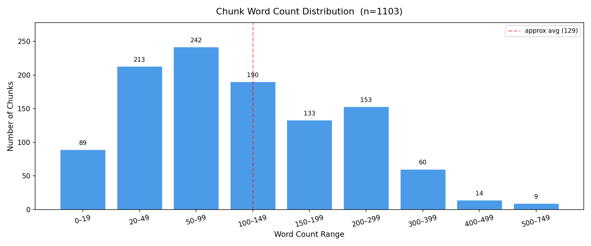
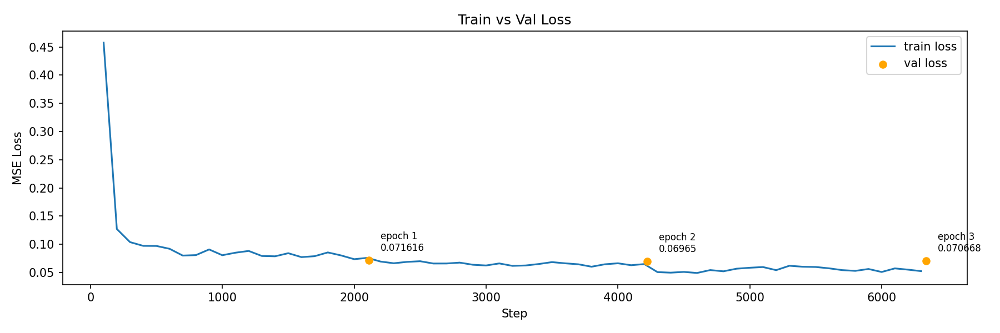
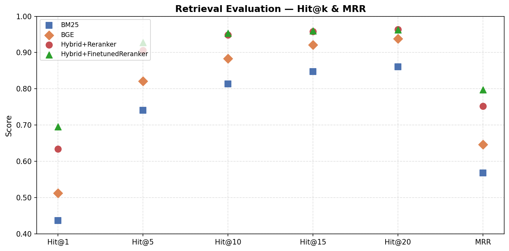

# RAG Pipeline Development Log

## 1. Walking Skeleton
Minimal end-to-end pipeline to validate system connectivity:
- **Parse**: `RecursiveCharacterTextSplitter`, text only (images ignored)
- **Retrieve**: BM25 only
- **Generate**: LLaMA 3.1 8B (no fine-tuning)

---

## 2. Parse Optimization

### Analysis Method
After each change, run `experiments/parse_analysis.py` to dump all chunks to `experiments/chunk_dump_<date>.txt` and inspect visually.

---

### Issues & Fixes (in order)

| # | Issue | Fix | Status |
|---|-------|-----|--------|
| 1 | Cover/back matter included (TOC, index, etc.) | Filter by `PAGE_START` / `PAGE_END` in `load_pdf()` | ✅ |
| 2 | Header/footer text leaking into chunks | Crop page rect by `PAGE_CROP_TOP` / `PAGE_CROP_BOTTOM` via fitz | ✅ |
| 3 | Dirty formatting (`\n` artifacts from two-column PDF layout) | TRY 1: regex (newline preceded by `.!?` + followed by uppercase) — partially effective. TRY 2: LLM-based cleaning (`llm_clean.py`, `temperature=0`) ✅ | ✅ |
| 4 | Chunks mixing content from different sections | See detailed notes below | ✅ |
| 5 | Cross-page splits | See detailed notes below | 🔲 |

---

### Chunk Word Count Distribution


### Issue 4: Chunks Mixing Content from Different Sections

**Problem:**
`RecursiveCharacterTextSplitter` splits purely by token count with no awareness of document structure. Results in chunks that mix unrelated content (e.g. a safety warning merged with an unrelated operation step, or two separate alert entries in one chunk).

**Attempted approaches:**

**TRY 1 — Semantic chunking** (`bge-m3` embeddings + cosine similarity breakpoints)
- Split pages by `\n\n` into paragraphs, compute embedding similarity between adjacent pairs, split at low-similarity boundaries
- Problem: adjacent entries share similar embeddings regardless of being different topics (e.g. two charging error alerts). Similarity score alone cannot detect structural boundaries. Also adds time per full run.
- Result: ❌ not reliable enough

**TRY 2 — LLM-based split** (update `llm_clean` prompt)
- `LLM_CLEAN_PROMPT` asks the LLM to clean the text AND insert `<<<SPLIT>>>` delimiter before each new semantic unit in a single pass
- `chunk_index.py` then simply splits on `<<<SPLIT>>>` — no embedding logic needed
- Why LLM over rules/regex: the manual contains many section types (alert entries, feature descriptions, numbered instructions, spec tables, warnings) with inconsistent structural signals. Rules cannot cover all cases reliably. LLM reads structure like a human.
- Result: ✅

**Prompt design decisions:**
- Semantic unit defined as: topic/subject/focus clearly shifts, signaled by a new code-like identifier (e.g. `PCS_a073`) OR a new heading/title
- Delimiter chose as `<<<SPLIT>>>` not `---SPLIT---`: LLM confused `---` with markdown horizontal rule and abbreviated the delimiter
- Added rule "do not split numbered or bulleted lists": LLM was treating each list item as a separate unit
- `temperature=0` for consistency across runs

**Pipeline after fix:**
```
load_pdf() → llm_clean_and_split() → pickle → split on <<<SPLIT>>> → save() → MongoDB
```
### Metadata Addition: chunk_index

Added `chunk_index` (global, zero-based, continuous across pages) to each chunk's metadata at index time.

**Reason:** Required for reranker fine-tuning — when mining hard negatives, chunks adjacent to the
ground truth (chunk_index distance ≤ 1) must be excluded regardless of page boundary. Page number
alone cannot identify adjacent chunks accurately: two chunks on different pages may be content-
continuous (cross-page split, Issue 5), and two chunks on the same page may be semantically
unrelated. chunk_index is the only reliable proximity signal.

**Impact:** chunk_index.py rerun required. QA dataset unaffected — unique_id is md5(page_content)
and does not depend on metadata.

---

### Issue 5: Cross-Page Splits

**Problem:**
`load_pdf()` processes one page at a time. An alert entry that starts on page N and ends on page N+1 becomes two separate `Document` objects before any LLM or chunking step runs. No prompt or chunking strategy can fix a problem that originates at the parsing stage.

Observed example: `PCS_a073` header on page 287, full body on page 288 — two separate chunks.

**Investigated approaches:**

| Approach | Verdict |
|----------|---------|
| Hard rules (detect incomplete page by missing `What to do:` section) | ❌ Unreliable — page can end after alert title with no detectable incomplete sentence |
| LLM merge (detect and merge incomplete pages before cleaning) | ✅ Correct but adds pipeline complexity and an extra LLM call per page |
| Overlapping page pairs `[N, N+1]`, `[N+1, N+2]` | ❌ Shifts the problem rather than solving it; also doubles collection size |
| Increase `TOPK` | ✅ Pragmatic mitigation — BM25 will likely surface both halves for a relevant query |

**Decision: defer.**
TOPK=5 retrieval likely surfaces both halves of a split alert together in context. Validate with targeted queries on known split alerts before investing in a parse-level fix. Revisit only if answer quality is measurably degraded.

**If fix becomes necessary:** implement LLM merge as a `merge_pages()` step in `parse.py`, storing page range `[N, N+1]` in metadata instead of a single page number to avoid losing source traceability.

---

### Refactor
`parse.py` split into two scripts for independent re-runs:
- `parse.py`: `load_pdf()` → `llm_clean_and_split()` → pickle
- `chunk_index.py`: load pickle → split on `<<<SPLIT>>>` → `save()` → MongoDB

---

## 3. Retrieve Optimization

### Overview

BM25-only retrieval surfaces correct results but is purely keyword-based — semantically equivalent queries can miss relevant chunks. Upgraded to a three-signal hybrid pipeline.

---

### Architecture

```
query
  ├── BGE-M3 dense  ──┐
  ├── BGE-M3 sparse ──┤ RRF fusion (Milvus internal) → top-k
  │                   └─────────────────────────────────────────┐
  │                                                             │ union + dedup
  └── BM25 ──────────────────────────────────────── top-k ──────┘
                                                      ↓
                                               candidate pool
                                                      ↓
                                                     reranker
                                                      ↓
                                                   LLM generate
```

---

### Retriever: BGE-M3 (`retrieve_bge.py`)

**Why bge-m3 over separate embedder + BM25:**
`bge-m3` is a three-in-one model producing dense, sparse, and ColBERT vectors in a single forward pass. Using it for both dense and sparse eliminates the need for a separate embedder.

**Dense vs sparse metric types:**
- Dense → `COSINE`: bge-m3 dense vectors are not normalized by default
- Sparse → `IP`: sparse vectors are non-negative weights, cosine is not meaningful here. **Not tunable — IP is correct for sparse.**

**ColBERT excluded:**
Requires N vectors per doc (one per token) vs 1 for dense — ~50x storage increase. Milvus-lite has limited ColBERT support. Diminishing returns for single-domain manual corpus. Revisit if quality remains poor after reranker.

**`encode_queries` vs `encode`:**
bge-m3 applies an internal query prefix during `encode_queries()` — must use this for queries, `encode()` for documents. Using wrong method degrades retrieval quality.

**Index persistence:**
Collection build skipped if Milvus collection already exists (`force_rebuild=False`). Pass `force_rebuild=True` explicitly after re-chunking to keep index in sync with MongoDB.

**Batch size:** `BGE_BATCH_SIZE=32` — affects build speed and GPU memory only, not retrieval quality. Tune only if OOM.

---

### Fusion: RRF

**Why RRF over WeightedRanker:**
RRF is rank-based — no score normalization needed across different scales (BM25 scores vs cosine similarity vs IP). `WeightedRanker` requires score-scale calibration. RRF is the safer default.

**`k=60`:** Standard constant from original RRF paper. Results not sensitive to this value. Not worth tuning.

**Dense:sparse ratio:** Implicitly 1:1 with RRF. To control ratio explicitly, switch to `WeightedRanker(sparse_weight, dense_weight)` — defer until eval data exists.

---

### Hybrid: BM25 Union (`retrieve_hybrid.py`)

**Why BM25 as union instead of third RRF signal:**
BGE sparse already covers most of BM25's lexical matching (learned weights vs frequency-based). BM25 is added as a **safety net** — guaranteed inclusion of exact keyword matches that BGE sparse might miss, regardless of topk size. Unioning after RRF ensures BM25 results are never dropped by rank competition.

**Edge case — cross-page split (Issue 5 deferred):**
Page 45 (steps 1-3) and page 46 (step 4) are separate chunks due to page boundary. BGE hybrid search alone missed page 46 — dense embedding of a short single-step chunk is less representative, gets pushed down by longer semantically richer chunks. BM25 union recovers it via exact keyword match ("shoulder", "anchor", "button"). Validated with query "How to Adjust the Shoulder Anchor Height" — page 46 now appears in candidate pool.

**Dedup order:** BGE results first, BM25 appended. BGE-ranked order is preserved for the reranker; BM25-only chunks appended at end.

---

## 4. Reranker

### Overview

Hybrid retrieval returns ~14-20 candidates including irrelevant chunks that share surface-level keyword overlap with the query (e.g. "Adjusting Liftgate Opening Height" retrieved for "How to Adjust the Shoulder Anchor Height"). A cross-encoder reranker filters these out before generation.

---

### Architecture

```
~20 candidates from HybridRetriever
  ↓
FlagReranker — score each (query, chunk) pair
  ↓
threshold filter (score > RERANKER_THRESHOLD)
  ↓
sort by score descending
  ↓
final chunks → LLM generate
```

---

### Why cross-encoder over threshold on hybrid search

RRF scores are rank-derived (`1/(60+rank)`) — not interpretable as relevance thresholds. Cross-encoder scores are trained relevance signals in `[0, 1]` range (with `normalize=True`) — directly threshold-able.

---

### Model: `bge-reranker-v2-m3`

- Cross-encoder, same BAAI family as bge-m3
- Input: `(query, passage)` pairs → single relevance score
- `normalize=True`: maps raw scores to `[0, 1]` for interpretable thresholding
- Score stored in `metadata["rerank_score"]` for debugging

---

### Threshold calibration

`RERANKER_THRESHOLD=0.1` — validated on query "How to Adjust the Shoulder Anchor Height":
- Page 45 (main procedure): `0.9994` ✅
- Page 46 (step 4 continuation): `0.23` ✅
- All 12 irrelevant candidates dropped ✅

**Edge case — cross-page split + reranker:**
Page 46 is a short incomplete chunk (step 4 only). Its rerank score (`0.23`) is significantly lower than page 45 (`0.9994`) despite being part of the same procedure. This is expected — the chunk lacks full context. It survived `RERANKER_THRESHOLD=0.1` but is fragile. If threshold is raised above `0.23`, step 4 is lost. Do not raise threshold above `0.2` until Issue 5 (cross-page merge) is resolved.

---

### Decisions deferred

| Decision | Reason |
|---|---|
| Qwen3-Reranker-4B | Heavier (4B), slower; cross-encoder sufficient for current query set. Revisit for complex/multi-faceted queries |
| Query decomposition | Multi-faceted queries ("how to adjust X and Y") degrade retrieval + reranking. Implement if such queries appear in eval set |
| WeightedRanker sparse:dense ratio | No eval data yet to justify tuning |
| Finetune RERANKER_THRESHOLD | Blocked by Issue 5 — e.g., page 46 fragile at current threshold |

---

## 5. Evaluation Dataset Generation

### Overview

Before optimizing generation, a ground truth QA dataset is needed to separate retrieval failures from generation failures. Without it, there is no signal on which layer is the bottleneck.

---

### Architecture

```
MongoDB chunks
      ↓
length filter (>= 15 words)      ← skip short/context-dependent chunks
      ↓
LLM generate 5 QA pairs per chunk
      ↓
LLM quality filter (score 1-5)   ← score each pair, save all with scores
      ↓
question expansion               ← (planned) paraphrases per question
      ↓
train/val/test split (70/20/10)
      ↓
add negative samples (MS MARCO)
      ↓
final dataset: {question, answer, unique_id}
```

---

### Ground Truth Mapping

QA generated **per chunk**. `unique_id` is known before LLM call.

This gives:
- `unique_id` → retrieval eval (did retriever surface the right chunk?)
- `question` + `answer` → generation eval (RAGAS, planned)

---

### Pipeline: generate.py

- Load all chunks from MongoDB, filter by `MINIMAL_CHUNK_SIZE = 15` words
- Concurrent LLM calls via `ThreadPoolExecutor(MAX_WORKERS=20)`
- Checkpoint by `source_chunk_id` — safe to resume after interruption
- Output: `data/qa_pairs/qa_raw.jsonl` — `{source_chunk_id, page, raw_resp}`

---

### Pipeline: filter.py

- Load `qa_raw.jsonl`, fetch source chunk from MongoDB per `source_chunk_id`
- LLM scores each (question, answer, chunk) pair on 1-5 scale
- Checkpoint by `(source_chunk_id, question)` — safe to resume
- Output: `data/qa_pairs/qa_filtered.jsonl` — `{source_chunk_id, page, question, answer, score, reason}`
- Nothing dropped at this stage — all pairs saved with scores for flexible downstream filtering

**Score criteria:**
- 5: perfectly grounded, complete, self-contained
- 4: mostly grounded, minor incompleteness
- 3: acceptable but partially incomplete
- 2: missing key info or partially ungrounded
- 1: hallucinated, or references page numbers/sections

---

### Length Filter

`MINIMAL_CHUNK_SIZE = 15` words. Short chunks are almost always context-dependent (e.g. "4. Without pressing the button...") and cannot produce self-contained questions. Combined with the quality filter downstream, this is sufficient.

**Edge case — cross-page split (Issue 5):**
Page 46 step 4 chunk (~130 chars) passes the length filter but is context-dependent. It will likely produce poor QA pairs caught by the quality filter (score 1-2).

---

### Pipeline: expand.py

- Load qa_filtered.jsonl, keep only score >= MIN_SCORE
- For each QA pair: LLM generates 3 paraphrases of the original question
- Concurrent LLM calls via ThreadPoolExecutor(MAX_WORKERS)
- Checkpoint by question — safe to resume after interruption
- Output: data/qa_pairs/qa_expand.jsonl — {source_chunk_id, page, question, answer, paraphrases}

**Why paraphrases:** A single phrasing of a question does not reflect the diversity of how real
users ask the same thing. Expanding each question with 3 paraphrases triples the effective
training set size and improves retriever/reranker robustness to query variation.

---

### Fix: Paraphrase Leakage in Train/Val/Test Split

**Problem:**
Original build_dataset.py flattened all paraphrases into individual samples first, then split
randomly. This caused paraphrases of the same original question to appear in different splits.
Since paraphrases are semantically near-identical, val/test scores were inflated — the model
had effectively seen the question during training.

**Fix:**
Split at the item level (one item = one original question + its paraphrases) before flattening.
Each item is assigned to exactly one split; flattening happens independently within each split.
MS MARCO negatives have no paraphrases and are split randomly as before.

---

## 6. Retrieval Evaluation
 
### Overview
 
Systematic comparison of all three retriever configurations on the test set to identify the best-performing pipeline before optimizing generation.
 
---
 
### Retrievers compared
 
| Name | Description |
|------|-------------|
| BM25 | Keyword-based baseline |
| BGE | Dense + sparse RRF internally via Milvus |
| Hybrid+Reranker | Hybrid candidates reranked by `bge-reranker-v2-m3`, treated as ranked list |
 
---
 
### Metrics
 
**Hit@k** — 1 if ground truth `unique_id` appears in top-k results, else 0; averaged over all questions.
 
**MRR (Mean Reciprocal Rank)** — `1/rank` if ground truth found, else 0; averaged over all questions. Computed once per retriever independent of k — reflects whether the correct chunk is ranked first, not just present.
 
**Why not Recall@k or Precision@k:**
Each question has exactly one ground truth `unique_id`. Under this condition, Recall@k = Hit@k (identical). Precision@k penalizes retrievers for returning unchosen-but-relevant chunks — unreliable with single-label ground truth.
 
---
 
### k sweep

`EVAL_K_VALUES = [1, 5, 10, 15, 20]` defined in `config.py`.

For each retriever: retrieve top-`max(k)=20` once, slice to each k — avoids redundant retrieval calls per question.

For `Hybrid+Reranker`: retrieve top-20 candidates → rerank → slice to k. Reranker may drop chunks below `RERANKER_THRESHOLD`, so Hit@k at small k may be lower than Hybrid alone — this is expected and meaningful signal about reranker precision.

---

### Results (500 samples)  

| Retriever | Hit@1 | Hit@5 | Hit@10 | Hit@15 | Hit@20 | MRR |
|-----------|-------|-------|--------|--------|--------|-----|
| BM25 | 0.4373 | 0.7407 | 0.8139 | 0.8480 | 0.8610 | 0.5687 |
| BGE | 0.5130 | 0.8213 | 0.8834 | 0.9212 | 0.9386 | 0.6467 |
| Hybrid+Reranker | 0.6346 | 0.9057 | 0.9485 | 0.9578 | 0.9634 | 0.7522 |

Hybrid+Reranker evaluated with `RERANKER_THRESHOLD=0.0` — threshold filtering disabled to measure pure ranking quality. In inference, a calibrated threshold will be applied to drop irrelevant chunks before generation; threshold should be re-calibrated after reranker fine-tuning as score distributions will shift.

---

### Findings

**BGE vs BM25:** BGE improves Hit@10 by +0.054 (0.826 → 0.880) and MRR by +0.049 (0.5777 → 0.6263). Semantic retrieval meaningfully outperforms keyword matching across all k values.

**Reranker significantly improves ranking quality:** Hybrid+Reranker Hit@1 jumps to 0.630 (+0.144 over Hybrid), MRR to 0.7406 (+0.114). Hit@10 reaches 0.936, Hit@20 reaches 0.956, meeting the target of 0.95+. The reranker effectively surfaces correct chunks from rank 11-20 into the top-10.

**Bottleneck shifts to fine-tuning:** With TOPK=20 and the off-the-shelf reranker, Hit@10=0.936 is the current ceiling. Fine-tuning the reranker on domain-specific data is expected to push Hit@10 to 0.95+, reducing reliance on TOPK=20.

---

### Next Steps

| Priority | Action | Reason |
|----------|--------|--------|
| 1 | Generate reranker training data | Three-class labels (positive/weak positive/negative) from existing QA pairs |
| 2 | Fine-tune reranker | Expected to push Hit@10 to 0.95+, reducing TOPK requirement from 20 to 10 |
| 3 | Re-calibrate RERANKER_THRESHOLD | Score distributions shift after fine-tuning; threshold needs re-validation |
| 4 | Analyze remaining Hit@20 miss cases | ~4% of queries still miss at k=20; identify root cause |

---

## 7. Reranker Fine-tuning

### Motivation

Off-the-shelf bge-reranker-v2-m3 achieves Hit@10=0.9485, MRR=0.7522. The remaining miss cases
are ranking failures — the correct chunk is in the candidate pool but ranked below irrelevant
chunks. Domain-specific fine-tuning is expected to improve Hit@1 and MRR, pushing the correct
chunk closer to rank 1.

---

### Training Data: Hard Negative Mining (`mine.py`)

**Pipeline:**
```
train.jsonl / val.jsonl  (positives only, source_chunk_id != None)
    ↓
HybridRetriever (topk=20) → FinetunedReranker (threshold=0.0) → ranked list
    ↓
adjacency filter: exclude abs(candidate.chunk_index - gt.chunk_index) <= 1
    ↓
weak_pos pool = filtered rank 2-5  → sample 1
neg pool      = filtered rank 6-10 → sample 1
    ↓
emit 3 samples per query: (query, gt, 1.0), (query, weak_pos, 0.5), (query, neg, 0.0)
```

**Why HybridRetriever + Reranker for mining:**
The rank window (2-5 for weak positive, 6-10 for negative) is only meaningful if candidates
are sorted by relevance. HybridRetriever output is not relevance-ranked (BGE results first,
BM25 appended). Running the reranker gives a meaningful ranked list before sampling.
Using the current reranker's output to generate training data introduces exposure bias, but
its effect is limited at this corpus scale — the ground truth label always comes from the QA
dataset, not from the reranker.

**Adjacency filter uses chunk_index, not page:**
Cross-page splits mean adjacent chunks may be on different pages. chunk_index is the only
reliable proximity signal across page boundaries.

**MINE_TOPK=20:**
Fetching 20 candidates (instead of 10) ensures the neg pool (rank 6-10) remains non-empty
after adjacency filtering removes ground truth and its neighbors.

**Dataset size:**
- Train triplets: 11,264 → 33,792 flat samples (×3)
- Val triplets:   3,216  →  9,648 flat samples (×3)

---

### Dataset (`dataset.py`)

Each triplet is flattened into 3 samples in fixed order:
- `(query, pos_chunk,      1.0)`
- `(query, weak_pos_chunk, 0.5)`
- `(query, neg_chunk,      0.0)`

Tokenization: `AutoTokenizer` with `text_pair`, `MAX_LENGTH=768`.

**Why MAX_LENGTH=768:**
Chunk token length distribution: max=1053, P99=686, P95=477, avg=183.
768 covers P99 (686) plus query (~50 tokens) and special tokens, with minimal truncation.

---

### Training Design (`train.py`)

| Decision | Choice | Reason |
|----------|--------|--------|
| Base model | bge-reranker-v2-m3 | Consistent with inference pipeline |
| PEFT | LoRA (r=16, alpha=32, dropout=0.1) | Reduces overfitting on small domain corpus |
| Loss | MSE | Directly supervises graded relevance labels (1.0 / 0.5 / 0.0) |
| dtype | bfloat16 | Same exponent range as float32; avoids fp16 overflow during training |
| Optimizer | AdamW | Standard for transformer fine-tuning |
| LR | 2e-4 | Standard LoRA starting point |
| Batch size | 16 | GPU memory limit on RTX 4090 D (24GB); 32 causes OOM |
| Epochs | 3 | Val loss plateaus after epoch 2; epoch 3 shows slight increase |

**LoRA target modules:** `["query", "key", "value", "dense"]`
Covers all attention self layers and FFN dense layers across 24 encoder layers.

**Trainable parameters:**
```
trainable params: 8,161,281 || all params: 574,866,433 || trainable%: 1.4197
```

**Classifier head unfrozen explicitly:**
After `get_peft_model()`, all non-LoRA parameters are frozen including the classifier head.
The head must be unfrozen to adapt the output projection to the domain regression task.

**Why pointwise MSE over pairwise BCE:**
Pairwise BCE is strictly binary (positive/negative). Our three-tier label design includes a
weak-positive tier (0.5) which carries meaningful signal. MSE directly supervises graded
relevance; pairwise would discard the intermediate tier.

---

### Logging

Single file `train_steps_{timestamp}.jsonl`:
- Per step (every 50 steps): `{"epoch": int, "step": int, "train_loss": float}`
- Per epoch: `{"epoch": int, "step": int, "val_loss": float}`

Val loss logged at the step corresponding to epoch end, enabling aligned plotting of train
and val loss on the same step axis.

---

### Results



| Epoch | Val Loss |
|-------|----------|
| 1 | 0.071616 |
| 2 | **0.069650** ← best |
| 3 | 0.070668 |

Best checkpoint: `epoch2_valloss_0.06965`

Train loss curve converges smoothly from ~0.45 to ~0.07 within the first 500 steps, then
stabilizes. Val loss aligns closely with train loss at epoch end — no significant overfitting.

---

### Retrieval Eval (Post Fine-tuning)

Evaluated on test set using `eval/retrieval/retrieval.py`:



| Retriever | Hit@1 | Hit@5 | Hit@10 | Hit@15 | Hit@20 | MRR |
|-----------|-------|-------|--------|--------|--------|-----|
| BM25 | 0.4373 | 0.7407 | 0.8139 | 0.8480 | 0.8610 | 0.5687 |
| BGE | 0.5130 | 0.8213 | 0.8834 | 0.9212 | 0.9386 | 0.6467 |
| Hybrid+Reranker | 0.6346 | 0.9057 | 0.9485 | 0.9578 | 0.9634 | 0.7522 |
| Hybrid+FinetunedReranker | **0.6960** | **0.9280** | **0.9529** | **0.9603** | **0.9628** | **0.7972** |

**Key findings:**
- Hit@1: +0.0614 (+9.7% relative over baseline Hybrid+Reranker)
- MRR: +0.0450 (+5.9% relative)
- Hit@10: +0.0044 (marginal — baseline already high at 0.9485)

Fine-tuning primarily improves ranking precision (correct chunk ranked higher), not recall
(correct chunk already in candidate pool). This is the expected outcome for reranker fine-tuning.

---

### Decisions Deferred

| Decision | Reason |
|----------|--------|
| RERANKER_THRESHOLD calibration | Fine-tuned model outputs raw logits (not normalized); threshold requires empirical calibration against generation quality |