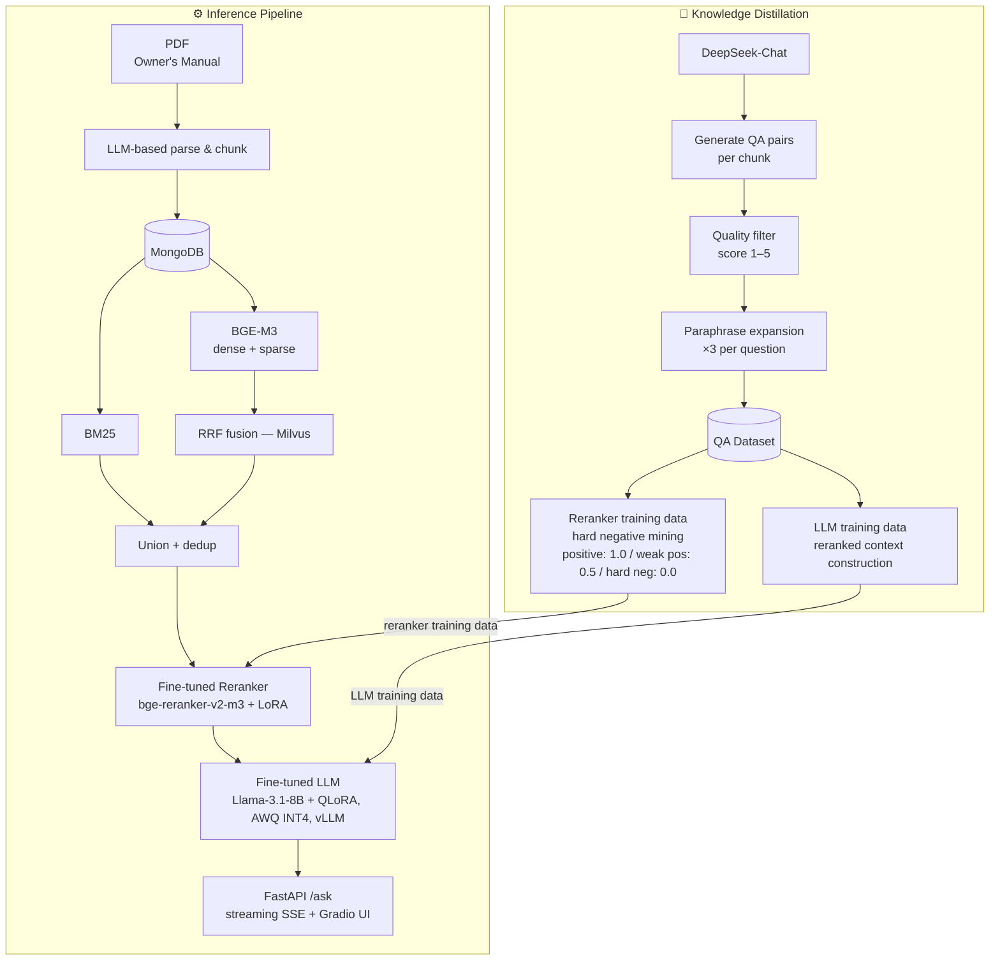
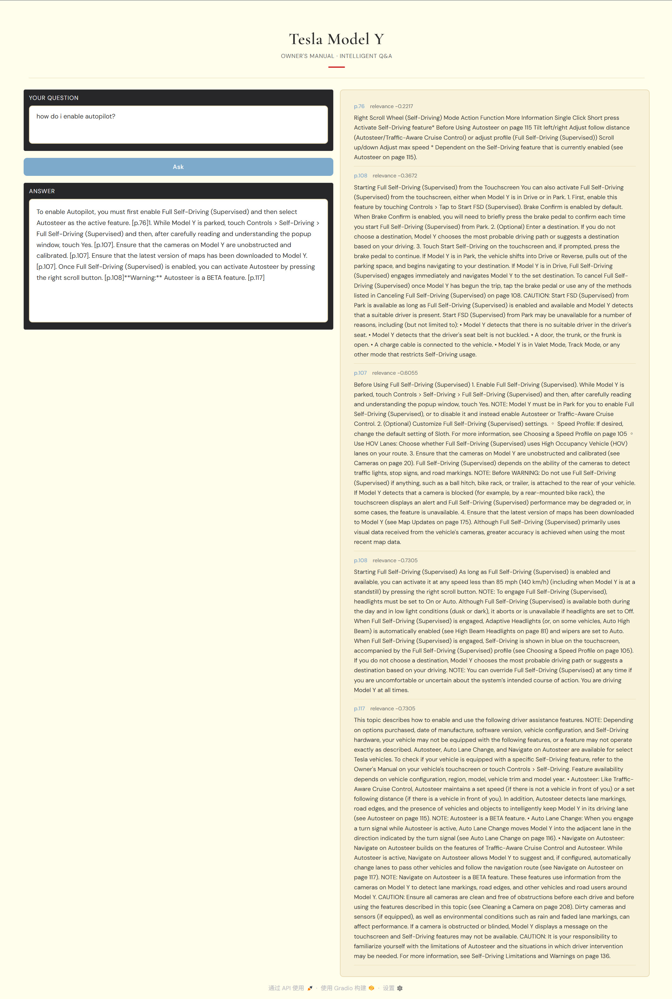
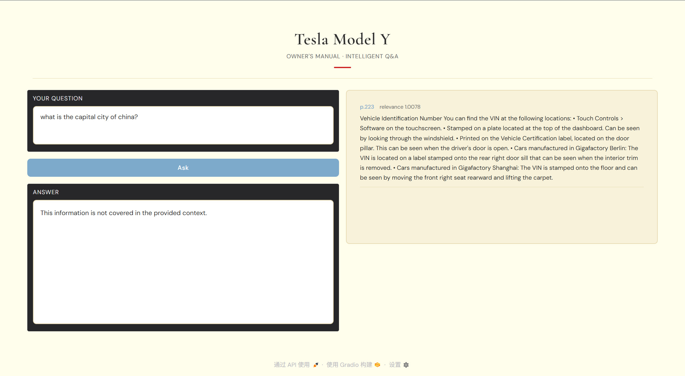
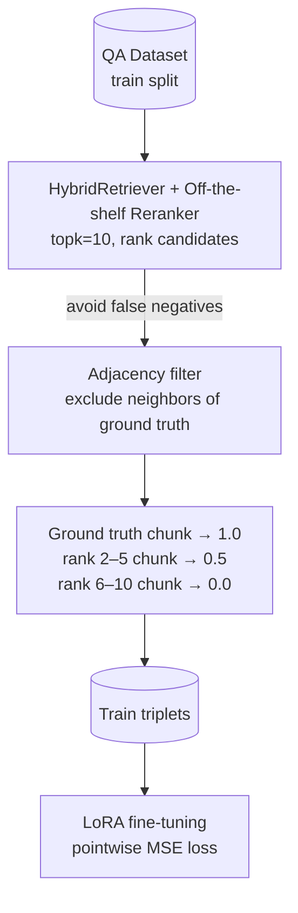
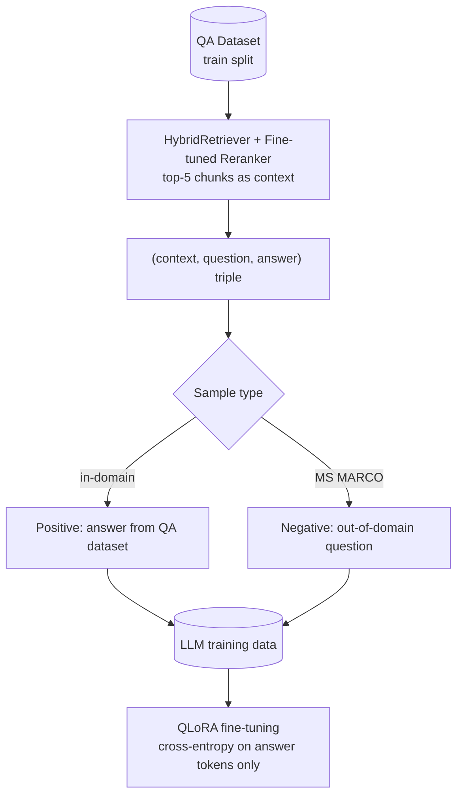

# Tesla Model Y RAG QA System

A production-oriented RAG pipeline for question answering over the Tesla Model Y Owner's Manual, built under a resource-constrained setting (single consumer GPU, RTX 4090 D 24GB). The project covers the full ML engineering lifecycle: LLM-based document parsing, hybrid retrieval, knowledge distillation from DeepSeek for dataset construction, domain-specific reranker and LLM fine-tuning, quantization, and streaming API serving.

---

## Quick Links

- [Just want to use it → Quickstart](#quickstart)
- [Want to reproduce everything → Full Pipeline Walkthrough](#full-pipeline-walkthrough)

---

## System Overview



> Detailed data pipeline: [Reranker training data](#stage-3--reranker-fine-tuning) · [LLM training data](#stage-4--llm-fine-tuning-qlora)

---

## Stack

| Layer | Technology |
|-------|------------|
| Document store | MongoDB 7.0 |
| Vector index | Milvus (dense + sparse) |
| Embedding & retrieval | Hybrid (BM25 + BGE sparse & dense) |
| Reranker | BGE-reranker-v2-m3 + LoRA fine-tuning |
| LLM | Llama-3.1-8B-Instruct + QLoRA + AWQ INT4 |
| LLM inference | vLLM |
| Knowledge distillation | DeepSeek-Chat |
| API | FastAPI (streaming SSE) |
| UI | Gradio |

---

## Results

### Retrieval (full test set, 2000+ samples)

| Retriever | Hit@1 | Hit@5 | Hit@10 | MRR |
|-----------|-------|-------|--------|-----|
| BM25 (baseline) | 0.4373 | 0.7407 | 0.8139 | 0.5687 |
| Hybrid (BM25 + BGE sparse & dense) | 0.5130 | 0.8213 | 0.8834 | 0.6467 |
| Hybrid + Reranker (off-the-shelf) | 0.6346 | 0.9057 | 0.9485 | 0.7522 |
| **Hybrid + Reranker (fine-tuned)** | **0.6960** | **0.9280** | **0.9529** | **0.7972** |

Reranker fine-tuning: +9.7% Hit@1, +5.9% MRR relative to off-the-shelf baseline.

### Generation (400 positive + 150 negative test samples)

| Metric | Baseline (off-the-shelf LLM) | Fine-tuned + Quantized (AWQ INT4) |
|--------|------------------------------|------------------------------------|
| Refusal rate | 0.9667 | **0.9800** |
| Faithfulness (RAGAS) | 0.8972 | 0.8379 |
| Answer Relevancy (RAGAS) | 0.8813 | 0.8738 |
| ROUGE-L | 0.4778 | **0.5661** |

Fine-tuning improved ROUGE-L by +18.5%. The Faithfulness drop is likely a **scoring artifact**: the fine-tuned model learned to append page citations from training data, which RAGAS cannot verify against raw chunk content and scores as unfaithful. — see `ENGINEERING_LOG.md` §9 for discussion.

### Gradio demo screenshot

<p align="center">
  
  
</p>

---

## Project Structure

```
├── app/
│   ├── api/              # FastAPI app (main.py, schemas.py)
│   ├── gradio/           # Gradio UI
│   └── load_test/        # Locust load test (locustfile.py)
├── data/
│   ├── Owners_Manual.pdf
│   ├── qa_pairs/         # QA dataset (raw → filtered → expanded → splits)
│   ├── reranker/         # Reranker triplets and checkpoints
│   └── llm/              # LLM training data, checkpoints, quantized model
├── eval/
│   ├── retrieval/        # Retrieval eval scripts and results
│   └── generate/         # Generation eval scripts and results
├── src/
│   ├── retriever/        # BM25, BGE, Hybrid retrievers
│   ├── reranker/         # Off-the-shelf and fine-tuned rerankers
│   └── client/           # MongoDB, vLLM clients
├── train/
│   ├── reranker_trainer/ # mine.py, dataset.py, train.py, eval.py
│   └── llm_trainer/      # dataset.py, train.py, merge_quantize.py
├── config.py
└── ENGINEERING_LOG.md
```

---

## Quickstart

For users who want to run the system with the pre-trained models.

### Prerequisites

- CUDA-capable GPU (tested on RTX 4090 D, 24GB VRAM)
- MongoDB 7.0 on port 27017
- Milvus on port 19530
- Conda

### 1. Clone the repository

```bash
git clone https://github.com/konami0328/manual-qa-rag.git
cd manual-qa-rag
```

### 2. Create and activate conda environment

```bash
conda create -n rag python=3.12 -y
conda activate rag
```

### 3. Install dependencies

```bash
pip install -r requirements.txt
```

### 4. Download pre-trained checkpoints

```bash
huggingface-cli download konami0328/tesla-model-y-rag \
    --repo-type model \
    --local-dir data/ \
    --include "reranker/ckpt/epoch2_valloss_0.06965/*" "llm/quantized/*"
```

### 5. Download MongoDB and models

```bash
# Download and extract MongoDB 7.0
bash download.sh

# Download embedding, reranker, and LLM models (requires modelscope)
bash models/download.sh
```

### 6. Start services (MongoDB + vLLM)

```bash
bash config.ini
```

### 7. Parse and index the manual

```bash
python -m src.parser.parse
python -m src.parser.chunk_index
```

### 8. Start the API server

```bash
uvicorn app.api.main:app --host 0.0.0.0 --port 8001
```

### 9. Launch the Gradio UI

```bash
python app/gradio/app.py
```

### 10. Query via API

```bash
curl -X POST http://localhost:8001/ask \
     -H "Content-Type: application/json" \
     -d '{"question": "How do I adjust the steering wheel?"}'
```

The `/ask` endpoint returns a streaming SSE response. Each message is prefixed with a type tag: `[CONTEXT]` (retrieved chunks), `[TOKEN]` (LLM output tokens), `[DONE]`, or `[ERROR]`.

---

## Full Pipeline Walkthrough

For users who want to reproduce the full training pipeline from scratch.

### Stage 1 — Parse & Chunk

Parse the PDF, clean formatting artifacts with an LLM, and split into semantic chunks.

```bash
python -m src.parser.parse        # load_pdf() → llm_clean_and_split() → pickle
python -m src.parser.chunk_index  # split on <<<SPLIT>>> → save to MongoDB + Milvus
```

Key decisions: LLM-based semantic splitting (over `RecursiveCharacterTextSplitter`), global `chunk_index` for adjacency-aware negative mining. See `ENGINEERING_LOG.md` §2.

---

### Stage 2 — Build Evaluation & Training Dataset (Knowledge Distillation)

Use DeepSeek-Chat to distill knowledge from the manual into a structured QA dataset. This dataset is the upstream source for both reranker and LLM training data.



```bash
# Generate 5 QA pairs per chunk
python -m src.data_preparation.generate

# Quality filter: LLM scores each (question, answer, chunk) triple 1–5
python -m src.data_preparation.filter

# Paraphrase expansion: 3 paraphrases per question (3× dataset size)
python -m src.data_preparation.expand

# Train/val/test split (70/20/10) at item level + MS MARCO negatives
python -m src.data_preparation.build_dataset
```

**Distillation design:**
- DeepSeek-Chat generates grounded, self-contained QA pairs directly from chunk content, transferring its reading comprehension capability into structured supervision signal for smaller models.
- Split is performed at the **item level** (original question + its paraphrases as one unit) before flattening, preventing paraphrase leakage across splits.
- Final dataset: 16,092 questions (after paraphrase expansion) + 5,000 MS MARCO negatives.

---

### Stage 3 — Reranker Fine-tuning

Mine hard negatives from the QA dataset and fine-tune the reranker with three-tier graded labels.

```bash
# Mine hard negatives (produces train_triplets.jsonl + val_triplets.jsonl)
python -m train.reranker_trainer.mine

# Train (LoRA, pointwise MSE, 3 epochs)
python -m train.reranker_trainer.train

# Evaluate on test set
python -m train.reranker_trainer.eval
```

**Training data construction (`mine.py`):**

For each question in the training set, run HybridRetriever + off-the-shelf Reranker to produce a ranked candidate list, then assign three-tier labels:

```
ground truth chunk          → label 1.0  (positive)
reranker rank 2–5 chunks    → label 0.5  (weak positive)
reranker rank 6–10 chunks   → label 0.0  (hard negative)
```

Chunks within `chunk_index` distance ≤ 1 of ground truth are excluded before sampling (adjacency filter). Loss: pointwise MSE over graded labels. Three-tier design is intentional — binary BCE would discard the weak-positive signal entirely.

---

### Stage 4 — LLM Fine-tuning (QLoRA)

Construct LLM training data using the fine-tuned reranker, then fine-tune with QLoRA.



```bash
# Build LLM training data:
# for each question, run fine-tuned reranker → top-5 chunks as context
python -m train.llm_trainer.mine

# Train (QLoRA, NF4 base + bf16 adapter, 2 epochs)
python -m train.llm_trainer.train

# Merge LoRA adapter into base model and quantize to AWQ INT4
python -m train.llm_trainer.merge_quantize data/llm/ckpt/epoch_1
```

**Why use the fine-tuned reranker for LLM data construction:**
The LLM trains on `(context, question, answer)` triples where context is the top-5 chunks returned by the fine-tuned reranker — the same context distribution it will see at inference. Training on ground truth chunks would create a distribution mismatch: the model would learn to answer from perfect context, but at inference would receive reranker output which may include partial or adjacent chunks.

---

### Stage 5 — Evaluation

```bash
# Retrieval: compare all retriever configurations on test set
python -m eval.retrieval.retrieval

# Generation: run full pipeline on test set
python -m eval.generate.generate_vllm

# Score with RAGAS + ROUGE-L
python -m eval.generate.eval eval/generate/results/generation_raw_<timestamp>.jsonl
```

---

## Limitations

- **Single document:** Corpus is limited to the Tesla Model Y Owner's Manual. Generalization to other documents is untested.
- **Cross-page splits (unresolved):** `load_pdf()` processes one page at a time; alert entries spanning a page boundary are split into two chunks. Mitigated at retrieval level but not fixed at parsing. See `ENGINEERING_LOG.md` §2.
- **Synthetic evaluation dataset:** QA pairs were generated by DeepSeek-Chat, not human-annotated. Ground truth answers reflect the model's paraphrase of manual content.
- **Fine-tuning and quantization effects are coupled:** The generation comparison uses AWQ INT4 for the fine-tuned model; individual contributions of fine-tuning and quantization are not separated.
- **Serialized inference:** Current serving setup does not support concurrent requests.
- **Limited concurrency:** The serving stack is bottlenecked by single-GPU LLM inference. Load testing shows end-to-end latency degrades from 2.5s (1 user) to 16s (10 users) as requests queue at the vLLM layer. Scaling requires multi-card tensor parallelism or higher-throughput hardware.